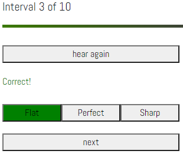
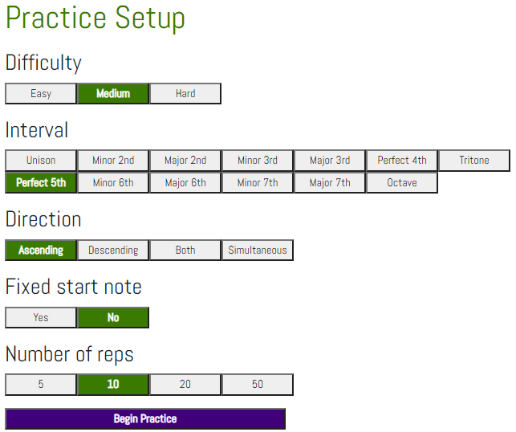
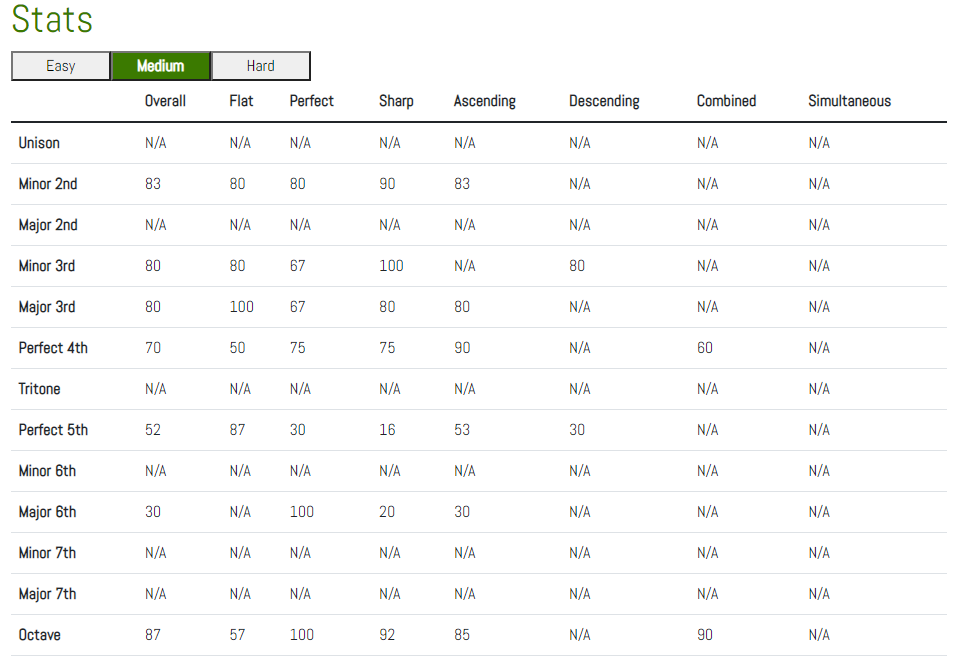
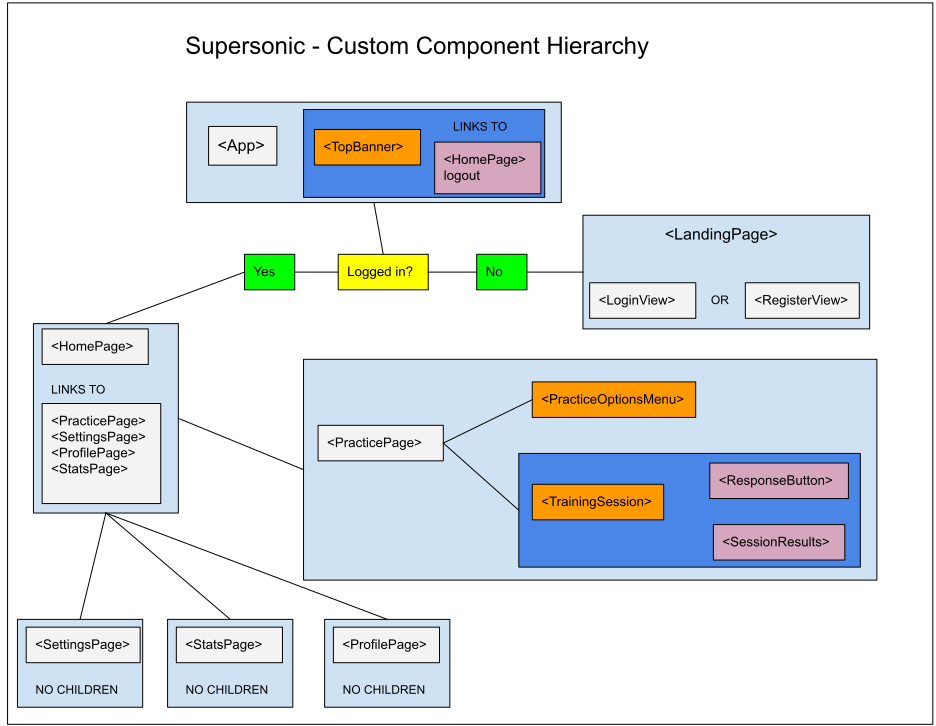

# Supersonic - Fine-Tuned Ear Training
## [Supersonic Ear Traning - Live Site](https://supersonic-ear-training.netlify.app)
## Overview
Supersonic is a web application designed to help skilled musicians improve their ability to identify out-of-tune notes. There are already several ear training apps available for free on the web, and many of them are very useful tools, but they only address part of the picture. Most apps teach musicians to identify the [interval between notes](https://en.wikipedia.org/wiki/Interval_(music)) that are in-tune. This is a critical skill for musicians, but any musician who plays a ["fretless" instrument](https://en.wikipedia.org/wiki/Cello) or an instrument where the player has [more control over the pitch](https://en.wikipedia.org/wiki/Wind_instrument) than a [piano](https://en.wikipedia.org/wiki/Piano) would (including the voice) must also be able to discern whether a given note is in-tune or not. This is because, while most western music pretends there are [12 notes divided evenly between each octave](https://en.wikipedia.org/wiki/Equal_temperament), the reality is there are an [infinite amount of notes](https://en.wikipedia.org/wiki/Microtonal_music) hiding between the notes we use in our music. A musician with undeveloped ears may be able to play notes that are generally correct, close enough the target frequencies of the notes they think they are playing that they sound good when playing alone, but in a group settings, these mistakes tend to become more obvious and detrimental to the group. 

My hope is that by using this app, intermediate level musicians who already have "decent" ears can level up their hearing and have great ears. This would allow them to identify notes they play as out-of-tune and correct their technique as needed to produce an in-tune note. This makes for happy musicians and happy audiences. 

## How It Works
### Practice Sessions
The user of the app will hear a series of "intervals", which are two notes played in succession or simultaneously. The two notes will either be perfectly in-tune according to equal temperament or out-of-tune by some number of cents. The user must determine if the second note they heard (or the higher frequency note if they are heard simultaneously) is in-tune, flat, or sharp.

_**Background info**: In equal temperament, each of the twelve notes are considered to be 100 "cents" away from the next adjacent note. Therefor, a note halfway between two notes would be 50 cents out-of-tune. If the note is lower in pitch compared to the target note, that note is "flat". If the note is higher in pitch compared to the target note, that note is "sharp"._

Users are able to select various options to customize their practice session. User have control over:
| Option           | Description                                                                                                                                                                                                                                                                                                                                                                                                                                                                                                                                                               |
| ---------------- | ------------------------------------------------------------------------------------------------------------------------------------------------------------------------------------------------------------------------------------------------------------------------------------------------------------------------------------------------------------------------------------------------------------------------------------------------------------------------------------------------------------------------------------------------------------------------- |
| Difficulty       | This is how out-of-tune the intervals will be. Difficulty ranges from **easy** (50 cents) to **medium** (25 cents) to **hard** (10 cents).                                                                                                                                                                                                                                                                                                                                                                                                                                |
| Interval         | This is the interval the user will practice with. Users should practice with each interval and focus on the ones that they have trouble with. Intervals range from **Unison** (same note) to **Octave** (double the frequency of the first note)                                                                                                                                                                                                                                                                                                                          |
| Direction        | This determines whether the second note will be higher frequency or lower frequency than the first note. The choices are **Ascending**, **Descending**, **Both**, or **Simultaneous**. It is important to practice each way, but selecting **Both** is a bit more difficult.                                                                                                                                                                                                                                                                                              |
| Fixed start note | This determines if the first note the user hears will always be the same. Before the user is well-practiced on an interval, it is best to use a fixed start note as it allows the user to keep a solid orientation for the base note in their mind. If **Fixed start note** is turned off, the first note of each interval will be randomly selected from a two-octave range between A3 and A5. Also, it is worth noting that lower frequencies are more difficult for humans to discern, so choosing a fixed start note can also be used to focus on the lower register. |
| Number of reps   | How many intervals will be included in the practice session. Ranges from 5 to 50.                                                                                                                                                                                                                                                                                                                                                                                                                                                                                         |

### Stats
Data is stored to the server for each practice session completed by the user. On the stats page, the data is fetched from the server and aggregated in a table. From this table, users should be able to identify which intervals they are struggling with and under which conditions they are having trouble.

This app doesn't have a leaderboard or any sort of competitive component. I want users to to do their best to improve their ears, not to find a way to game the system and get a high score.

## How to Run Project Locally
This project is developed on the MERN stack, so you'll need NPM and Node.js installed on your computer. You'll also need to install Parcel, the bundling tool used for the client app.

Down the source code. This repository contains the code for both the API and the user app. These are separate repositories, so will will need to run `npm install` twice, once in the `supersonic/app` folder, and again in the `supersonic/server` folder.
### Run API
To run the API server, navigate to 'supersonic/server' and run `node index.js`. The server will run on `localhost:8080`. The JWT encryption key and database connection key are saved as environment variables on Heroku, so if you are interested in tinkering with the server, you'll need to connect it to your own database with your own credentials.
### Run Application
To run the application, navigate to `supersonic/app/src` and run `parcel index.html`. The app will run on `localhost:1234` and will automatically re-compile when you make changes to the source code.

## Deployment
### Database
Supersonic handles its Mongo database using MongoDB Atlus free tier. A connection URI is present as an environment variable saved in Heroku and referenced in the API.
### API
The API is hosted with Heroku. New commits are handled using the Heroku CLI. Detailed instructions are available on Heroku's site. To push a new deploy to Heroku, I follow these steps:
- Change the code in the Git repository connected to Heroku.
- `git add .`
- `git commit -am "hopefully this is an improvment, IDK"`
- `git push heroku master`

### Client Application
The Supersonic client application is hosted on Netlify. I have automatic builds enabled, so any time I push to my main branch on GitHub, Netlify builds my project with Parcel and deploys it.

## Technologies Used
### API
For an overview of the API endpoints, [click here](https://supersonic-api.herokuapp.com/documentation.html).

The API is built using an Express server connected to my Mongo database.
Aside from the registration (no auth) and login (basic http auth) endpoints, each endpoint is protected with JWT authorization. Additionally, each endpoint that handles data for a specific user requires that the username encoded in the JWT match the username of the user they are trying to access data for. This prevents people from accessing other users' data.

### Client Application
The client application is built using React as a framework. Routing is handled with React-Router-DOM using hash routing. The following diagram shows the shows how the React Components built for the app connect to each other.

## Coming Improvements
- Explore more pleasant tones
- Explore buggy mobile performance for web audio api